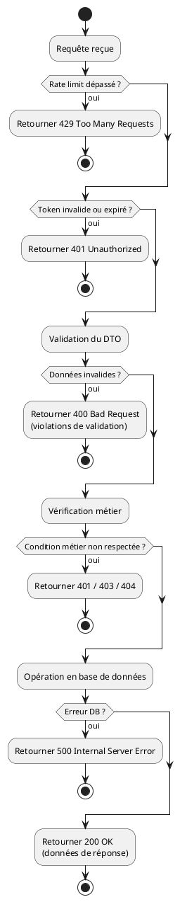

# Guide IA — Contribuer à l'API

[← Retour au sommaire](./SUMMARY.md)

Ce document est destiné aux agents IA travaillant sur le Foundation Kit. Il définit un workflow structuré et reproductible pour créer, modifier ou étendre des features de l'API tout en respectant la philosophie du projet : **architecture par domaines, diagramme en premier, tests avant le code**.

Suivre ce guide dans l'ordre garantit une implémentation cohérente, testée et documentée.

> **Important — génération frontend automatique :** La documentation Swagger n'est pas optionnelle. Le frontend utilise **Orval** pour générer automatiquement les hooks React Query, les types TypeScript et les schémas Zod à partir du spec OpenAPI. Chaque `@ApiProperty`, `@ApiResponse` et `@ApiOperation` manquant ou incorrect se traduit directement par du code frontend cassé ou absent.

---

## Lecture préalable obligatoire

Avant toute action, **lire les documents de référence correspondants** dans `docs/api/`. Cette documentation contient les conventions, patterns et règles que tout le code existant respecte. L'ignorer aboutit à du code incohérent avec le reste du projet.

### Documents à lire selon l'action


| Action envisagée              | Documents à lire en priorité                                                     |
| ----------------------------- | -------------------------------------------------------------------------------- |
| Toute action                  | [Structure domain](./11-structure-domain.md) · [Responses](./06-responses.md)    |
| Créer / modifier un endpoint  | [Swagger](./13-swagger.md) · [Routes](./12-routes.md) · [Guards](./08-guards.md) |
| Créer / modifier un DTO       | [Traductions](./15-traductions.md) · [Filters](./05-filters.md)                  |
| Modifier la base de données   | [Database](./02-database.md) · [Prisma](./10-prisma.md)                          |
| Écrire des tests              | [Tests](./14-tests.md) · [Diagrams](./03-diagrams.md)                            |
| Gérer des fichiers / médias   | [Media](./09-media.md)                                                           |
| Gérer la session / les tokens | [Gestion de la session](./07-session.md) · [Guards](./08-guards.md)              |
| Ajouter des traductions       | [Traductions](./15-traductions.md) · Script `node check/translation.mjs`         |


### Référence complète de la documentation API


| #   | Document                                     | Contenu clé                                          |
| --- | -------------------------------------------- | ---------------------------------------------------- |
| 01  | [Configuration](./01-config.md)              | Variables d'environnement, constantes, cookies       |
| 02  | [Database](./02-database.md)                 | Modèles Prisma, relations, index                     |
| 03  | [Diagrams](./03-diagrams.md)                 | Format PlantUML, structure des fichiers              |
| 04  | [Faker](./04-faker.md)                       | Génération de données de test                        |
| 05  | [Filters](./05-filters.md)                   | Filtres d'exception, transformation des erreurs      |
| 06  | [Responses](./06-responses.md)               | `ResponseUtil`, format standard des réponses         |
| 07  | [Gestion de la session](./07-session.md)     | JWT, cookies, tokens, `needToReconnect`              |
| 08  | [Guards](./08-guards.md)                     | `AuthGuard`, `RolesGuard`, `@Public()`               |
| 09  | [Media](./09-media.md)                       | Upload, validation, redimensionnement                |
| 10  | [Prisma](./10-prisma.md)                     | Client Prisma, migrations, types générés             |
| 11  | [Structure domain](./11-structure-domain.md) | Architecture DDD, patterns module/controller/service |
| 12  | [Routes](./12-routes.md)                     | Liste des routes, publiques vs protégées             |
| 13  | [Swagger](./13-swagger.md)                   | Décorateurs OpenAPI, génération Orval                |
| 14  | [Tests](./14-tests.md)                       | Jest, Supertest, `initTestApp`, nettoyage            |
| 15  | [Traductions](./15-traductions.md)           | i18n, clés, `i18nValidationMessage()`                |


---

## Vue d'ensemble du workflow

```
1. Analyser & découper la feature
         ↓
2. Créer le diagramme PlantUML
         ↓
3. Modifier le schéma Prisma (si nécessaire)
         ↓
4. Implémenter dans les domaines
         ↓
5. Écrire & vérifier les tests
         ↓
6. Valider la checklist finale
```

---

## Étape 1 — Analyse & découpage de la feature

### 1.1 Résumer la feature

Avant toute implémentation, résumer la feature en 2-3 phrases en répondant à ces questions :

- **Que fait cette feature ?** (comportement attendu)
- **Qui l'utilise ?** (utilisateur authentifié, public, admin)
- **Quelles données sont créées/modifiées/supprimées ?**

### 1.2 Décomposer en sous-tâches atomiques

Identifier chaque élément à créer ou modifier :


| Élément       | Action                                 | Notes                        |
| ------------- | -------------------------------------- | ---------------------------- |
| Domaine       | Nouveau / Existant                     | Ex: `user`, `auth`           |
| Endpoint(s)   | Route + méthode HTTP                   | Ex: `POST /user/preferences` |
| Modèle Prisma | Nouveau champ / Nouveau modèle / Aucun |                              |
| Fichier i18n  | Nouvelle clé / Nouveau fichier         |                              |
| Test spec     | Nouveau fichier / Mise à jour          |                              |
| Diagramme     | Nouveau fichier                        |                              |


### 1.3 Identifier les impacts

- Quels **domaines existants** sont impactés (ex: un service `user` qui dépend de `media`) ?
- Des **tests existants** pourraient-ils être affectés par les changements ?
- Y a-t-il une **migration Prisma** nécessaire ?

### 1.4 Lire le code existant du domaine

Si la feature touche un domaine existant, **lire les fichiers du domaine avant d'écrire quoi que ce soit** :

```
api/src/domains/{domain}/
├── controller/{domain}.controller.ts   ← endpoints existants, pattern utilisé
├── service/{domain}.service.ts         ← logique métier, méthodes disponibles
├── dto/                                ← DTOs existants, conventions de nommage
└── module/{domain}.module.ts           ← imports, exports, providers
```

Cela permet d'éviter de dupliquer du code existant, de casser un pattern en place, ou d'injecter un service déjà disponible d'une mauvaise façon.

---

## Étape 2 — Diagramme PlantUML

### 2.1 Créer le fichier

Créer un fichier `.txt` dans `api/diagrams/{domain}/{feature}/{feature}.txt`.

La structure du dossier doit refléter celle des domaines :

```
api/diagrams/
├── auth/
│   └── login/
│       ├── login.txt    ← code source PlantUML
│       └── login.png    ← image générée
├── user/
│   └── preferences/
│       ├── preferences.txt
│       └── preferences.png
```

### 2.2 Contenu du diagramme

> **Avant d'écrire le diagramme**, lire les fichiers `.txt` existants dans `api/diagrams/` (ex: `auth/login/login.txt`, `user/register/register.txt`) pour comprendre le niveau de détail et le style attendu.

Le diagramme doit couvrir **tous les chemins possibles** de la requête :

- Rate limiting (429 si dépassé)
- Vérification d'authentification (401 si token absent/invalide) — **routes protégées uniquement**
- Validation des données (400 si invalide)
- Vérifications métier (401, 403, 404 selon les cas)
- Opérations en base de données
- Réponse de succès (200 ou 201)

**Exemple de structure PlantUML — route protégée :**



> Pour une **route publique**, supprimer le bloc "Token invalide ou expiré".

### 2.3 Générer le PNG

> **Action utilisateur requise**
>
> Après avoir créé le fichier `.txt`, demander à l'utilisateur de générer l'image PNG via :
> **[http://www.plantuml.com/plantuml/uml/](http://www.plantuml.com/plantuml/uml/)**
>
> Coller le contenu du `.txt` dans l'éditeur, copier l'image générée et la sauvegarder en `.png` dans le même dossier.
>
> Les deux fichiers (`.txt` et `.png`) doivent être committés ensemble.

Voir aussi : [Diagrams](./03-diagrams.md)

---

## Étape 3 — Modifications Prisma (si nécessaire)

### 3.1 Modifier le schéma

Modifier `api/prisma/schema.prisma` en respectant les conventions du projet :

- Identifiant `@id @unique @default(uuid())`
- Champs d'audit : `createdAt DateTime @default(now())` et `updatedAt DateTime @updatedAt` — **exception : `RevokedToken` n'a ni `createdAt` ni `updatedAt`** (seulement `revokedAt` et `expirationDate`)
- Relations avec `onDelete: Cascade` pour le nettoyage automatique
- Énumérations pour les types finis (Role, Gender, etc.)

**Exemple d'ajout d'un modèle :**

```prisma
model UserPreferences {
  id           String   @id @unique @default(uuid())
  userId       String   @unique
  user         User     @relation(fields: [userId], references: [id], onDelete: Cascade)
  newsletter   Boolean  @default(false)
  createdAt    DateTime @default(now())
  updatedAt    DateTime @updatedAt

  @@map("user_preferences")
}
```

### 3.2 Appliquer la migration

> **Action utilisateur requise**
>
> ```bash
> npx prisma migrate dev --name <nom-de-la-migration>
> ```
>
> Exemple : `npx prisma migrate dev --name add-user-preferences`

### 3.3 Fichiers i18n (si nouveau domaine)

Si la feature introduit un **nouveau domaine**, créer les fichiers de traduction :

```
api/src/i18n/
├── fr/
│   └── {domain}.json    ← à créer
└── en/
    └── {domain}.json    ← à créer
```

Structure minimale d'un fichier de traduction :

```json
{
  "feature": {
    "success": "Opération réussie",
    "validation": {
      "field": {
        "is-string": "Ce champ doit être une chaîne de caractères",
        "is-not-empty": "Ce champ ne peut pas être vide"
      }
    },
    "error": {
      "not-found": "Ressource introuvable"
    }
  }
}
```

Voir aussi : [Database](./02-database.md), [Prisma](./10-prisma.md), [Traductions](./15-traductions.md)

---

## Étape 4 — Implémentation dans les domaines

### 4a. Structure du domaine

**Nouveau domaine :** créer la structure standard et enregistrer le module. Le domaine `src/domains/template/` sert de référence — s'en inspirer comme point de départ.

```
src/domains/{domain}/
├── controller/
│   └── {domain}.controller.ts
├── service/
│   └── {domain}.service.ts
├── dto/
│   ├── {domain}-{action}-body.dto.ts
│   └── {domain}-{action}-response.dto.ts
├── decorators/
│   └── {domain}-{action}.decorator.ts
└── module/
    └── {domain}.module.ts
```

Dossiers optionnels à créer selon les besoins du domaine :


| Dossier      | Quand l'utiliser                                           |
| ------------ | ---------------------------------------------------------- |
| `interface/` | Interfaces TypeScript internes (ex: `JwtPayloadInterface`) |
| `enums/`     | Énumérations spécifiques au domaine                        |
| `types/`     | Types utilitaires du domaine                               |
| `utils/`     | Fonctions utilitaires locales                              |
| `guard/`     | Guards spécifiques au domaine                              |


Enregistrer le module dans `src/domains/app/module/app.module.ts` :

```typescript
import { NouveauDomaineModule } from '../nouveau-domaine/module/nouveau-domaine.module';

@Module({
  imports: [
    // ... modules existants
    NouveauDomaineModule,
  ],
})
export class AppModule {}
```

**Domaine existant :** identifier précisément les fichiers à modifier (controller, service, DTO, decorator).

**Quand créer un nouveau domaine vs utiliser un domaine existant :**


| Situation                                                                                   | Action               |
| ------------------------------------------------------------------------------------------- | -------------------- |
| La feature est une extension logique d'un concept existant (ex: nouvelle action sur `user`) | Ajouter à l'existant |
| La feature est un nouveau concept métier autonome (ex: `notifications`, `subscriptions`)    | Nouveau domaine      |
| La feature est partagée par plusieurs domaines (utilitaires, helpers)                       | Domaine `common`     |


**Exports de module — utilisation cross-domaine :**

Si un service d'un domaine doit être utilisé par un autre domaine, il doit être **exporté** depuis son module et le module consommateur doit l'**importer**.

```typescript
// module du domaine fournisseur : exporter le service
@Module({
  controllers: [UserController],
  providers: [UserService],
  exports: [UserService],   // ← rend UserService injectable ailleurs
})
export class UserModule {}

// module du domaine consommateur : importer le module
@Module({
  imports: [UserModule],    // ← donne accès à UserService
  providers: [FeatureService],
})
export class FeatureModule {}
```

`PrismaService` et `I18nService` sont globaux — ils sont injectables dans n'importe quel service sans import supplémentaire.

> **Dépendances circulaires :** si deux modules s'importent mutuellement, NestJS lèvera une erreur au démarrage. Utiliser `forwardRef()` pour résoudre le cycle :
>
> ```typescript
> import { forwardRef } from '@nestjs/common';
>
> @Module({
>   imports: [forwardRef(() => UserModule)],  // ← résout le cycle
>   providers: [FeatureService],
>   exports: [FeatureService],
> })
> export class FeatureModule {}
> ```

### 4b. Règles décorateurs (composite)

Chaque endpoint doit avoir son propre décorateur composite dans `{domain}/decorators/`.

**Règle absolue :** utiliser `applyDecorators()` — jamais de décorateurs Swagger directement sur le controller.

```typescript
// src/domains/{domain}/decorators/{domain}-{action}.decorator.ts
import { applyDecorators, Post, Get, Patch, Delete, HttpCode, HttpStatus } from '@nestjs/common';
import { ApiBody, ApiOperation, ApiResponse } from '@nestjs/swagger';
import { Throttle } from '@nestjs/throttler';
import { Public } from 'src/domains/common/decorators/public.decorator';

export function FeatureEndpoint(path: string) {
  return applyDecorators(
    Post(path),    // ou Get(path), Patch(path), Delete(path) selon le cas
    HttpCode(HttpStatus.OK),   // à ajuster : Post retourne 201 par défaut, Get retourne 200
    Public(),                  // Uniquement pour les routes publiques
    ApiOperation({
      summary: 'Titre court',
      description: 'Description détaillée de l\'endpoint',
    }),
    ApiBody({
      type: FeatureBodyDTO,
      description: 'Description du corps de la requête',
    }),
    ApiResponse({ status: 200, type: FeatureResponseDTO }),
    ApiResponse({ status: 400, type: ValidationExceptionResponseDTO }),
    ApiResponse({ status: 429, type: TooManyRequestResponseDTO }),
    ApiResponse({ status: 500, type: InternalServerErrorExceptionResponseDTO }),
    Throttle({ default: { ttl: THROTTLE_TTL.TTL_GENERAL, limit: THROTTLE_TTL.LIMIT_GENERAL } }),
  );
}
```

> **Imports des DTOs de réponse communs :** `ValidationExceptionResponseDTO`, `TooManyRequestResponseDTO` et `InternalServerErrorExceptionResponseDTO` sont importés depuis `src/domains/common/dto/response/api-response.dto`.

**Récapitulatif selon le type de route :**


| Type de route   | Décorateurs à inclure                                                                    |
| --------------- | ---------------------------------------------------------------------------------------- |
| Publique        | `@Public()`                                                                              |
| Protégée (JWT)  | `@ApiBearerAuth()` (pas de `@Public()`)                                                  |
| Upload fichier  | `@ApiConsumes('multipart/form-data')` + `@UseInterceptors(FileInterceptor('fieldName'))` |
| Admin seulement | `@Roles(Role.admin)`                                                                     |


> **Note — `@ApiBearerAuth()` est Swagger UI uniquement.** Il documente l'endpoint dans l'interface `/api` pour permettre les tests manuels. L'authentification réelle n'utilise **pas** le header `Authorization` — le `AuthGuard` lit le cookie `access_token`. Ne pas confondre documentation Swagger et implémentation.

**Constantes de throttle — comment les utiliser :**

Les constantes de throttle sont définies dans `src/domains/common/constants/constants.ts` via `createThrottleConstants(nodeEnv)`. **La référence à suivre est `api/src/domains/auth/decorators/auth-login.decorator.ts`** : c'est le décorateur le plus complet du projet et il montre exactement comment intégrer le throttle dans un décorateur composite.

**Codes HTTP par défaut selon la méthode HTTP :**


| Méthode            | Code par défaut NestJS | `HttpCode` nécessaire si... |
| ------------------ | ---------------------- | --------------------------- |
| `Get()`            | 200                    | Jamais (200 est le défaut)  |
| `Post()`           | 201                    | Retourner 200 à la place    |
| `Patch()`, `Put()` | 200                    | Jamais (200 est le défaut)  |
| `Delete()`         | 200                    | Retourner 204 No Content    |


### 4c. Règles DTOs

**Nommage des fichiers :**

- Corps de requête : `{domain}-{action}-body.dto.ts`
- Réponse : `{domain}-{action}-response.dto.ts`

**Règles de validation :**

```typescript
import { ApiProperty } from '@nestjs/swagger';
import {
  IsString, IsNotEmpty, IsEmail, IsEnum, IsBoolean,
  IsOptional, IsDateString, MinLength, MaxLength,
} from 'class-validator';
import { Transform } from 'class-transformer';
import { i18nValidationMessage } from 'nestjs-i18n';

export class FeatureBodyDTO {
  // Décorateur sans paramètre → clé i18n directe
  @ApiProperty()
  @IsString({ message: 'domain.feature.validation.field.is-string' })
  @IsNotEmpty({ message: 'domain.feature.validation.field.is-not-empty' })
  @IsEmail({}, { message: 'domain.feature.validation.email.is-email' })
  email: string;

  // Décorateur avec paramètre → i18nValidationMessage()
  @ApiProperty()
  @MinLength(8, {
    message: i18nValidationMessage('domain.feature.validation.password.min-length'),
  })
  password: string;

  // Enum → i18nValidationMessage() avec args personnalisés
  @ApiProperty({ enum: Status })
  @IsEnum(Status, {
    message: i18nValidationMessage('domain.feature.validation.status.is-enum', {
      enumValues: Object.values(Status).join(', '),
    }),
  })
  status: Status;
}
```

**Tableau récapitulatif :**


| Décorateur                                    | Paramètres ? | Syntaxe message                                              |
| --------------------------------------------- | ------------ | ------------------------------------------------------------ |
| `@IsString()`, `@IsEmail()`, `@IsNotEmpty()`  | Non          | `message: 'clé.i18n'`                                        |
| `@MinLength(8)`, `@MaxLength(50)`, `@Min(18)` | Oui          | `message: i18nValidationMessage('clé')`                      |
| `@IsEnum(Enum)`                               | Oui          | `message: i18nValidationMessage('clé', { enumValues: ... })` |


**Rendre un champ optionnel dans un DTO :**

Pour qu'un champ soit optionnel (non requis dans la requête), utiliser `@IsOptional()` combiné à `@ApiProperty({ required: false })` et typer le champ avec `?` :

```typescript
export class UserUpdateBodyDTO {
  @ApiProperty({ required: false })
  @IsOptional()
  @IsString({ message: 'user.update.validation.first-name.is-string' })
  @MinLength(4, { message: i18nValidationMessage('user.update.validation.first-name.min-length') })
  firstName?: string;
}
```

Sans `@IsOptional()`, le champ est requis et son absence provoque un `400`.

**Champs enum dans `@ApiProperty()` :**

Toujours déclarer l'enum dans la propriété Swagger pour qu'il apparaisse correctement dans la documentation et la génération Orval :

```typescript
@ApiProperty({ enum: Gender, enumName: 'Gender' })
@IsEnum(Gender, {
  message: i18nValidationMessage('user.register.validation.gender.is-enum', {
    enumValues: Object.values(Gender).join(', '),
  }),
})
gender: Gender;
```

**Transformation de valeurs :**

**Booleans en FormData** — quand un endpoint accepte `multipart/form-data`, les booleans arrivent sous forme de string (`"true"`/`"false"`). Utiliser `@Transform` pour les convertir :

```typescript
import { Transform } from 'class-transformer';

@ApiProperty({ required: false, type: Boolean })
@IsOptional()
@Transform(({ value }) => value === 'true' || value === true)
@IsBoolean({ message: 'user.update.validation.notification-email.is-boolean' })
notificationEmail?: boolean;
```

**Dates (JSON et FormData)** — le champ DTO est un `string` au format `YYYY-MM-DD`. La conversion en `Date` se fait dans le service avec `new Date(dto.dateOfBirth)` avant l'écriture en base :

```typescript
@ApiProperty()
@IsDateString({}, { message: 'user.register.validation.date-of-birth.is-date' })
@IsNotEmpty({ message: 'user.register.validation.date-of-birth.is-not-empty' })
@MinLength(10, { message: i18nValidationMessage('user.register.validation.date-of-birth.min-length') })
dateOfBirth: string;
```

**Impact du pipe global `whitelist: true` :**

Le pipe de validation global est configuré avec `whitelist: true` et `forbidNonWhitelisted: true`. Conséquence directe : **tout champ envoyé par le client et absent du DTO sera rejeté avec une erreur 400**. Chaque champ attendu doit donc être explicitement déclaré dans le DTO — rien ne passe silencieusement.

**Pattern des Response DTOs :**

Chaque endpoint doit avoir son propre Response DTO qui documente la structure de `data` pour Swagger et Orval. Le pattern est d'étendre `SuccessResponseDTO` et d'utiliser `declare` pour typer le champ `data` sans ajouter de propriété runtime :

```typescript
import { ApiProperty } from '@nestjs/swagger';
import { SuccessResponseDTO } from 'src/domains/common/dto/response/api-response.dto';

// DTO imbriqué décrivant la structure de data
class UserProfileDataDTO {
  @ApiProperty()
  id: string;

  @ApiProperty()
  email: string;

  @ApiProperty()
  firstName: string;
}

// Response DTO de l'endpoint
export class UserProfileResponseDTO extends SuccessResponseDTO {
  @ApiProperty({ type: UserProfileDataDTO })
  declare data: UserProfileDataDTO;  // "declare" = typage seul, pas de propriété runtime
}
```

Ce `declare data` est ce qui permet à Orval de générer le bon type TypeScript côté frontend.

### 4d. Règles traductions

**Correspondance fichier / clé :** le nom du fichier JSON correspond au **premier segment** de la clé utilisée dans le code. Exemple : la clé `user.register.validation.email.is-email` est définie dans `src/i18n/fr/user.json` au chemin `register.validation.email.is-email`.

**Hiérarchie des clés** (kebab-case) : `domain.feature.type.field.rule`

```json
{
  "feature": {
    "success": "Opération réussie",
    "validation": {
      "email": {
        "is-string": "L'email doit être une chaîne",
        "is-email": "L'email n'est pas valide",
        "is-not-empty": "L'email est requis"
      },
      "password": {
        "min-length": "Le mot de passe doit contenir au moins {constraints.0} caractères"
      }
    },
    "error": {
      "already-exists": "Cette ressource existe déjà"
    }
  }
}
```

**Règle critique — que traduire vs que coder en anglais :**

La règle n'est pas "service vs controller" — c'est **"qui produit le message final vu par le client ?"**

- Si l'exception remonte jusqu'au filtre global et est retournée telle quelle au client → **traduire**
- Si l'exception est intentionnellement catchée en interne par un guard ou un autre service qui va lui-même produire un message traduit → **code anglais** (le catch intermédiaire traduit)

```typescript
// ✅ Traduit — cette exception atteint directement le client
// (le filtre global la retourne telle quelle)
throw new UnauthorizedException(
  this.i18n.t('auth.login.invalid-credentials'),
);

// ✅ Traduit — message de succès retourné au client
return ResponseUtil.success(
  HttpStatus.OK,
  this.i18n.t('user.profile.success'),
  userData,
);

// ✅ Code anglais — AccessTokenService throw pour AuthGuard
// AuthGuard catch l'erreur et produit lui-même un message traduit
// → le message de ce throw n'atteint jamais le client directement
throw new UnauthorizedException('INVALID_TOKEN');
throw new NotFoundException('USER_NOT_FOUND');
```

**En pratique :** la quasi-totalité des exceptions dans les services et controllers doivent être **traduites**. Les codes anglais ne concernent que les services internes appelés par des guards (ex: `AccessTokenService`, `RevokedTokenService`).

**Toujours ajouter les clés dans les deux langues :**

- `src/i18n/fr/{domain}.json`
- `src/i18n/en/{domain}.json`

**Vérifier les traductions avec le script d'audit :**

Après tout ajout ou modification de clés de traduction, exécuter depuis `api/` :

```bash
node check/translation.mjs
```

Le script vérifie que chaque clé utilisée dans le code existe en FR et EN, et qu'aucune clé dans les JSON n'est inutilisée (code mort). **Tous les problèmes signalés doivent être corrigés avant de continuer.**

Voir [Traductions — Script de vérification](./15-traductions.md#script-de-vérification-des-traductions) pour le détail.

### 4e. Règles controllers/services

**Controller — responsabilités :**

- Recevoir la requête et déléguer au service
- Construire la réponse avec `ResponseUtil`
- Injecter `I18nService` pour les messages de réponse
- Logger NestJS optionnel : `private readonly logger = new Logger(FeatureController.name)`

```typescript
@ApiTags('domain')
@Controller('domain')
export class FeatureController {
  constructor(
    private readonly featureService: FeatureService,
    private readonly i18n: I18nService,
  ) {}

  @FeatureEndpoint('action')
  async action(@Body() dto: FeatureBodyDTO) {
    const result = await this.featureService.doAction(dto);
    // Avec données retournées
    return ResponseUtil.success(
      HttpStatus.OK,
      this.i18n.t('domain.action.success'),
      result,
    );
  }

  @FeatureEndpoint('create')
  async create(@Body() dto: FeatureBodyDTO) {
    await this.featureService.create(dto);
    // Sans données (endpoint void : register, update, delete...)
    return ResponseUtil.success(
      HttpStatus.CREATED,
      this.i18n.t('domain.create.success'),
    );
  }
}
```

**Service — responsabilités :**

- Logique métier
- Accès à la base de données via `PrismaService`
- Lever des exceptions pour les erreurs métier
- Logger NestJS pour le debugging : `private readonly logger = new Logger(FeatureService.name)`
- Si la feature modifie le mot de passe : mettre `needToReconnect: true` sur le `User` pour invalider les autres sessions actives (voir [Gestion de la session](./07-session.md))

```typescript
import * as bcrypt from 'bcrypt';

@Injectable()
export class FeatureService {
  private readonly logger = new Logger(FeatureService.name);

  constructor(
    private readonly prisma: PrismaService,
    private readonly i18n: I18nService,
  ) {}

  async doAction(dto: FeatureBodyDTO) {
    const existing = await this.prisma.model.findUnique({
      where: { field: dto.field },
    });

    if (!existing) {
      // Exception qui atteint le client → traduit
      throw new NotFoundException(
        this.i18n.t('domain.action.error.not-found'),
      );
    }

    return this.prisma.model.create({ data: dto });
  }

  async updatePassword(userId: string, newPassword: string) {
    const hashed = await bcrypt.hash(newPassword, 10);
    await this.prisma.user.update({
      where: { id: userId },
      data: { password: hashed, needToReconnect: true },
    });
  }
}
```

### 4f. Validation croisée dans le controller

Certaines validations ne peuvent pas être faites dans le DTO (ex: vérifier que deux champs sont égaux, ou vérifier l'unicité en base). Ces vérifications se font **dans le controller**, après la validation du DTO, en construisant un tableau de violations avant de lancer une exception.

> **Important :** tout service utilisé pour la validation croisée (ex: `userService.findByEmail()`) doit être **injecté dans le constructeur du controller**. `ValidationViolation` est importé depuis `src/domains/common/dto/response/api-response.dto`.

```typescript
import { ValidationViolation } from 'src/domains/common/dto/response/api-response.dto';

async register(@Body() dto: UserRegisterBodyDTO) {
  const violations: ValidationViolation[] = [];

  // Vérification croisée (ex: confirmation de mot de passe)
  if (dto.password !== dto.confirmPassword) {
    violations.push({
      field: 'password',
      message: this.i18n.t('user.register.validation.password.is-not-equal'),
    });
    violations.push({
      field: 'confirmPassword',
      message: this.i18n.t('user.register.validation.confirm-password.is-not-equal'),
    });
  }

  // Vérification en base (ex: unicité de l'email)
  const emailExists = await this.userService.findByEmail(dto.email);
  if (emailExists) {
    violations.push({
      field: 'email',
      message: this.i18n.t('user.register.validation.email.is-not-exist'),
    });
  }

  if (violations.length > 0) {
    throw new BadRequestException(ResponseUtil.validationError(violations));
  }

  await this.userService.create(dto);
  return ResponseUtil.success(HttpStatus.CREATED, this.i18n.t('user.register.success'));
}
```

### 4g. Accéder à l'utilisateur authentifié

Dans les endpoints protégés, l'`AuthGuard` injecte automatiquement l'objet `User` Prisma complet dans `req.user` après validation du token. C'est le pattern à utiliser — aucun import supplémentaire dans le module n'est nécessaire.

```typescript
import { Req } from '@nestjs/common';
import { Request } from 'express';

@ProfileEndpoint('profile')
async getProfile(@Req() req: Request) {
  const user = req.user as User;
  const profile = await this.featureService.findById(user.id);
  return ResponseUtil.success(
    HttpStatus.OK,
    this.i18n.t('user.profile.success'),
    profile,
  );
}
```

> **`req.user`** contient l'objet `User` Prisma complet (tous les champs du modèle), injecté par `AuthGuard` avant que la méthode du controller soit appelée. Il n'est pas nécessaire de revalider le token manuellement.

Voir aussi : [Structure domain](./11-structure-domain.md), [Swagger](./13-swagger.md), [Traductions](./15-traductions.md)

---

## Étape 5 — Tests

### 5.1 Créer le fichier de test

Créer `api/test/{domain}/{feature}.spec.ts` en suivant la structure standard :

```typescript
import * as request from 'supertest';
import { HttpStatus } from '@nestjs/common';
import { TestApp, cleanupTestApp, initTestApp } from '../test-setup';
import { loginUser } from '../test-helpers';
import { cleanupTestUser } from '../cleaning';

describe('{domain}/{feature} (e2e)', () => {
  let testApp: TestApp;

  beforeAll(async () => {
    testApp = await initTestApp();
  });

  afterAll(async () => {
    // true = supprimer l'utilisateur de test créé par initTestApp après la suite
    // false = conserver l'utilisateur (utile si d'autres suites partagent le même user)
    await cleanupTestApp(testApp, true);
  });

  // ---- Cas de validation ----

  it('❌ devrait retourner 400 si le champ requis est manquant', async () => {
    const response = await request(testApp.app.getHttpServer())
      .post('/{domain}/{feature}')
      .send({})
      .expect(HttpStatus.BAD_REQUEST);

    // Vérifier la structure des violations — ne pas se contenter de toBeDefined()
    expect(response.body.statusCode).toBe(HttpStatus.BAD_REQUEST);
    expect(response.body.violations).toBeInstanceOf(Array);
    expect(response.body.violations.length).toBeGreaterThan(0);
    expect(response.body.violations[0].field).toBe('fieldName');
  });

  // ---- Cas d'erreur métier ----

  it('❌ devrait retourner 401 si non authentifié', async () => {
    const response = await request(testApp.app.getHttpServer())
      .post('/{domain}/{feature}')
      .send({ field: 'value' })
      .expect(HttpStatus.UNAUTHORIZED);

    expect(response.body.statusCode).toBe(HttpStatus.UNAUTHORIZED);
  });

  // ---- Cas de succès ----

  it('✅ devrait réussir avec des données valides', async () => {
    // loginUser() authentifie l'utilisateur de test et stocke les cookies
    // dans testApp.agent pour les requêtes suivantes.
    // Retourne { accessToken, refreshToken, cookieHeader } si besoin d'utiliser
    // les tokens directement (ex: tester un header Authorization).
    await loginUser(testApp);

    const response = await testApp.agent
      .post('/{domain}/{feature}')
      .send({ field: 'value' })
      .expect(HttpStatus.OK);

    // Vérifier le message exact (correspond à la clé i18n traduite)
    expect(response.body.statusCode).toBe(HttpStatus.OK);
    expect(response.body.message).toBe('Message exact retourné par l\'API');
    expect(response.body.data).toBeDefined();
    expect(response.body.data.id).toBeDefined();

    // Nettoyage local si des tokens ou données ont été créés
    await cleanupTestUser(testApp.createdUserId, testApp.prismaService, false);
  });
});
```

> **Champs disponibles sur `testApp` :**
>
> - `testApp.createdUserId` — l'id `string` de l'utilisateur de test
> - `testApp.createdUser` — l'objet `User` Prisma complet (tous les champs : `email`, `role`, `createdAt`, etc.)
> - `testApp.agent` — agent SuperTest avec cookies persistants
> - `testApp.prismaService` — accès direct à Prisma pour les vérifications en base

> **`testApp.agent`** vs **`request(testApp.app.getHttpServer())`** :
>
> - `testApp.agent` : utilise un agent persistant qui conserve les cookies entre les requêtes. À utiliser pour les endpoints protégés après `loginUser(testApp)`.
> - `request(testApp.app.getHttpServer())` : requête sans cookies. À utiliser pour les endpoints publics ou les tests d'authentification manquante.

### 5.2 Couvrir tous les chemins du diagramme

**Règle :** chaque branchement du diagramme = au moins un test.


| Chemin du diagramme   | Test correspondant                                    |
| --------------------- | ----------------------------------------------------- |
| Rate limit dépassé    | *(non testable — voir note ci-dessous)*               |
| DTO invalide          | `❌ devrait retourner 400 si {champ} manquant`         |
| Non authentifié       | `❌ devrait retourner 401 sans token`                  |
| Ressource introuvable | `❌ devrait retourner 404 si {ressource} n'existe pas` |
| Succès                | `✅ devrait retourner 200 avec des données valides`    |


> **Note — 429 non testable :** Le throttle est désactivé en environnement de test (limites très élevées). Ne pas écrire de test pour le cas 429 — il ne peut pas être déclenché de manière fiable. Le documenter dans le diagramme suffit.

### 5.3 Vérifier les tests existants

Avant de lancer les tests, relire les specs du domaine impacté pour identifier les tests qui pourraient être affectés par les changements. Les mettre à jour si nécessaire.

### 5.4 Lancer les tests

> **Action utilisateur requise**
>
> Demander à l'utilisateur de lancer les tests :
>
> ```bash
> # Sur Windows
> npm run test:win
>
> # Sur Linux/Mac
> npm run test:linux
> ```
>
> **Tous les tests doivent passer** avant de considérer la feature terminée. Si des tests échouent, corriger le code ou les tests avant de continuer.

Voir aussi : [Tests](./14-tests.md)

---

## Checklist de validation

Utiliser cette checklist avant de considérer la feature comme terminée.

### 1. Analyse

- [ ] Feature résumée en 2-3 phrases
- [ ] Sous-tâches identifiées et listées
- [ ] Domaines impactés identifiés
- [ ] Modèles Prisma impactés identifiés
- [ ] Tests existants potentiellement impactés identifiés

### 2. Diagramme

- [ ] Fichier `.txt` créé dans `api/diagrams/{domain}/{feature}/`
- [ ] Tous les chemins couverts (validations, codes HTTP, DB, branchements)
- [ ] PNG généré par l'utilisateur et sauvegardé dans le même dossier
- [ ] Les deux fichiers (`.txt` + `.png`) prêts à être committés
- [ ] Diagramme ajouté dans la liste de [docs/api/03-diagrams.md](./03-diagrams.md)

### 3. Base de données

- [ ] `api/prisma/schema.prisma` mis à jour (ou non nécessaire)
- [ ] Migration appliquée par l'utilisateur (`npx prisma migrate dev --name ...`)
- [ ] Fichiers i18n créés pour le nouveau domaine (`fr` + `en`) si applicable

### 4. Implémentation

- [ ] Code du domaine existant lu avant d'écrire quoi que ce soit
- [ ] Structure du domaine créée ou fichiers existants mis à jour
- [ ] Module enregistré dans `app.module.ts` (si nouveau domaine)
- [ ] `exports: [ServiceName]` dans le module si le service est utilisé ailleurs
- [ ] Module du domaine fournisseur importé dans le module consommateur (si cross-domaine)
- [ ] Décorateur composite créé pour chaque endpoint (référence : `auth-login.decorator.ts`)
- [ ] `@Public()` présent sur les routes publiques, absent sur les routes protégées
- [ ] `@ApiBearerAuth()` présent sur les routes protégées (Swagger uniquement)
- [ ] Body DTOs : `@ApiProperty()` sur chaque champ + validations i18n
- [ ] `@ApiProperty({ enum: EnumType, enumName: 'EnumType' })` pour les champs enum
- [ ] `@IsOptional()` + `required: false` pour les champs optionnels
- [ ] `@Transform()` pour les booleans FormData, `@IsDateString()` + `@MinLength(10)` pour les dates (conversion `new Date(dto.dateOfBirth)` dans le service)
- [ ] `i18nValidationMessage()` pour les décorateurs avec paramètres (`@MinLength`, `@IsEnum`, etc.)
- [ ] Response DTO créé avec `declare data: TypeDTO` étendant `SuccessResponseDTO`
- [ ] Traductions ajoutées dans `fr` ET `en` (nom du fichier = premier segment de la clé)
- [ ] Script `node check/translation.mjs` exécuté — aucun problème signalé
- [ ] Validations croisées gérées dans le controller (violations[] + `ResponseUtil.validationError`)
- [ ] Exceptions service/controller traduits (sauf si catchées en interne par un guard)
- [ ] `needToReconnect: true` mis à jour si la feature modifie le mot de passe

### 5. Tests

- [ ] Fichier de test créé dans `api/test/{domain}/{feature}.spec.ts`
- [ ] Un test par branchement du diagramme
- [ ] Tests de validation (400), d'auth (401), d'erreur métier, et de succès
- [ ] Tests existants du domaine vérifiés (pas de régression)
- [ ] **L'utilisateur a lancé les tests et tous passent**

### 6. Swagger & documentation

- [ ] Swagger correctement documenté (vérifier sur `/api` après démarrage)
- [ ] Codes HTTP cohérents entre le diagramme, l'implémentation et les tests
- [ ] Endpoint ajouté dans [docs/api/12-routes.md](./12-routes.md) (si nouvelle route)
- [ ] Tags Swagger corrects (`@ApiTags('{domain}')` sur le controller)

### 7. Impact frontend (si DTO modifié)

Toute modification d'un DTO existant (ajout, suppression, changement de caractère requis/optionnel d'un champ) se répercute sur le code frontend généré par Orval : types TypeScript, hooks React Query et schémas Zod.

- [ ] Régénérer le client frontend avec Orval après chaque changement de DTO
- [ ] Vérifier les formulaires qui utilisent le schéma Zod modifié (champs `required`, validation, valeurs par défaut)

> Voir [Guide IA — Contribuer au Frontend](../front/18-agent-ia.md) pour le détail du processus de régénération Orval et la mise à jour des formulaires.

---

[← Retour au sommaire](./SUMMARY.md)